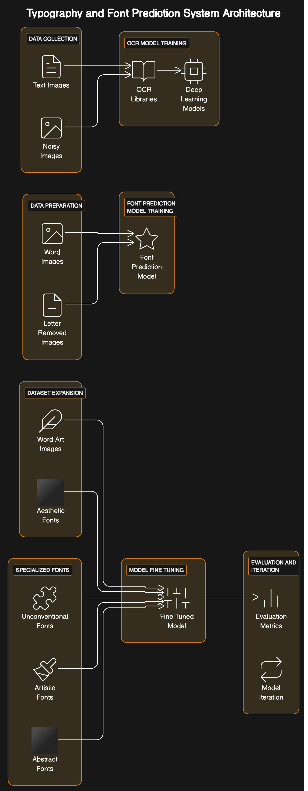

# Lexthetic Works - Word Art GAN Project

Lexthetic Works is a project focused on generating stylized and aesthetically pleasing word art using Generative Adversarial Networks (GANs). The GAN is trained to understand various typography styles and produce creative text compositions.

## Table of Contents
- [Overview](#overview)
- [Features](#features)
- [Usage](#usage)
- [Dataset](#dataset)
- [License](#license)

## Overview

Lexthetic Works leverages GANs to create word art that spans different aesthetic styles, including a wide range of aesthetics. The project involves training models to understand typography and generate word art in diverse and stylized fonts.

## Features

- **Typography Understanding:** OCR model for recognizing and understanding different fonts and characters.
- **Font Prediction:** Model trained to predict missing letters in a given font.
- **Stylized Fonts:** Training on word art and aesthetic-specific fonts for diverse and aesthetically pleasing text generation.
- **Specialized Fonts:** Fine-tuning on very stylized fonts to push the boundaries of creativity.

## Dataset

The dataset used for training comprises various fonts, styles, and aesthetics. Refer to the Dataset section in the codebase for more details on the dataset structure.

Usage
To generate word art using the trained model:

Clone this repository:

bash
Copy code
git clone https://github.com/yourusername/lexthetic-works.git
cd lexthetic-works
Install the required dependencies (see Installation).

Run the generate.py script with your input word or phrase:

bash
Copy code
python generate.py --text "Your Word" --style "aesthetic_style"
The output image will be saved in the output/ directory.

Installation
To get started with Lexthetic Works, follow these steps:

Clone the Repository:

git clone https://github.com/yourusername/lexthetic-works.git
cd lexthetic-works
Install Dependencies: Make sure you have Python 3.x installed. Install the necessary packages with:

pip install -r requirements.txt

Download the dataset as mentioned in the Dataset section.

## License

This project is licensed under the MIT License.
